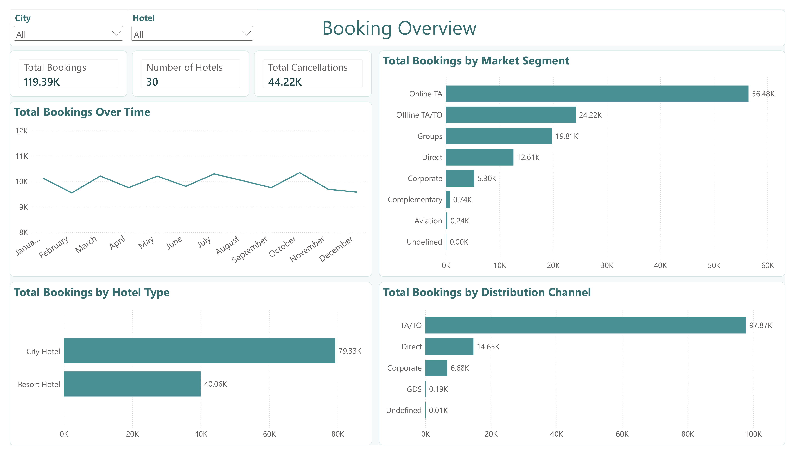
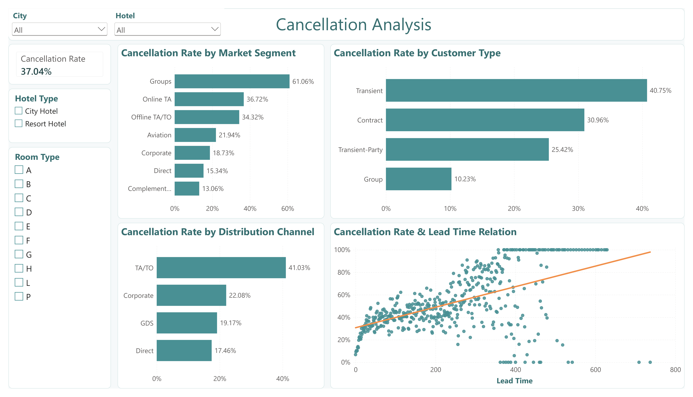
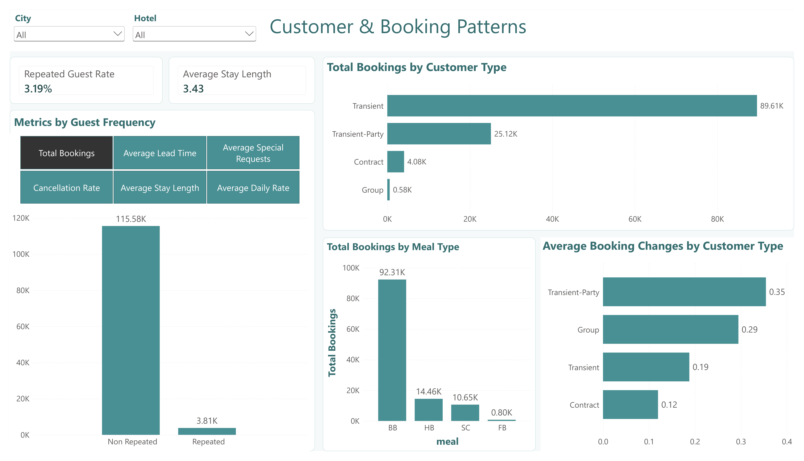
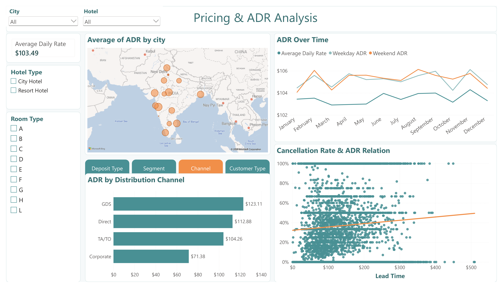

# Hotel Bookings Analysis

## Project Overview

The goal of this project is to analyse hotel booking data to identify patterns in volume, cancellations and guest behaviour.

The analysis was developed using SQL queries and Power BI, combining data exploration with an interactive dashboard.

## Business Questions

The analysis focuses on the following questions:

1. How are bookings distributed across hotel types, cities, market segments, and distribution channels?

2. How does the cancellation rate vary across customer types, market segments, distribution channels, hotel types, and room types?
   
3. Is there a relationship between lead time (time between the reservation and stay date) and cancellation rate?
   
4. How do repeated and non-repeated guests differ in their booking behaviour?
   
5. How does ADR vary across hotel types, room types, cities, market segments, deposit types, and distribution channels?
   
6. How does ADR evolve over time, and are there meaningful differences between weekday and weekend rates?
   
7. Are there observable relationships between ADR and cancellation behaviour?

8. How do booking changes vary across customer types?

## Key Insights

### Booking Overview

* **City Hotels represent the majority of bookings**, with approximately 78.3K bookings compared with 40.1K for Resort Hotels.
  
* **Online Travel Agencies (Online TA)** are the largest market segment, accounting for approximately 54.5K bookings.
  
* **Travel Agencies/Travel Operator (TA/TO) are the dominant distribution channel**, with approximately 97.9K bookings.
  
* Booking volume remained **remarkably stable throughout 2024**, ranging from approximately 9.6K bookings in February to 10.3K in October, with no strong seasonal pattern.
  
* Booking volumes are also **relatively evenly distributed across cities**, with Bhopal having the highest volume at approximately 8.1K bookings and Indore the lowest at approximately 7.8K.

### Cancellation Analysis

* The overall **cancellation rate is 37.04%**.
  
* **Transient bookings have the highest cancellation rate among customer types**, at 40.75%.
  
* **Groups have the highest cancellation rate among defined market segments**, at 61.06%.
  
* **TA/TO has the highest cancellation rate among distribution channels**, at 41.03%.
  
* A **positive relationship is visible between lead time and cancellation rate**: bookings made further in advance tend to have higher cancellation rates.
  
* **City Hotels have a higher cancellation rate than Resort Hotels**, at 41.73% versus 27.76%.
  
* Room Type P shows a 100% cancellation rate, but this appears to be an **outlier and should not be treated as representative without considering its very small number of bookings**.

### Guest & Booking Behaviour

* Only **3.19% of bookings are from repeated guests**, meaning the dataset is strongly dominated by non-repeated bookings.
  
* **Transient customers account for the majority of bookings**, with approximately 89.6K bookings.
  
* Repeated and non-repeated guests show notable behavioural differences:

  * Average lead time: **30.79 days for repeated guests vs 106.43 days for non-repeated guests**.
    
  * Cancellation rate: **14.49% vs 37.79%**.
    
  * Average stay length: **1.93 vs 3.48 nights**.
    
  * Average special requests: **0.63 vs 0.57 per booking**.
    
  * Average Daily Rate: **$64.54 vs $103.06**.
    
* **BB (Bed & Breakfast)** is the most common meal type, with approximately 92.3K bookings.
  
* Transient-Party customers show the highest average number of booking changes, at approximately **0.35 per booking**.

### Pricing & ADR (Average Daily Rate)

* The overall **Average Daily Rate is $103.49**.
  
* **City Hotels have a slightly higher ADR than Resort Hotels**, with City Hotels at approximately $106.87.
  
* **Room Type H has the highest average ADR**, at approximately $190.12.
  
* **GDS has the highest ADR among distribution channels**, at approximately $123.11.
  
* ADR remains **highly stable throughout 2024**, with monthly values ranging only from approximately $102.91 to $104.29.
  
* Weekday and weekend ADR also remain highly stable, with only minor differences.
  
* ADR varies more across booking characteristics than across time or cities. For example, ADR ranges from approximately **$76.21 to $105.50 across deposit types** and from approximately **$87.67 to $108.71 across customer types**.

* **Higher ADR is generally associated with higher cancellation rates, but this does not mean that higher ADR causes more cancellations.**

## Power BI Dashboard

The Power BI report consists of four pages:

### 1. Booking Overview

Provides an overview of booking volume across cities, hotels and distribution channels, with booking trends throughout 2024.

### 2. Cancellation Analysis

Explores cancellation rates across multiple variables, including the relationship between lead time and cancellation behaviour.

### 3. Customer & Booking Behaviour

Delves into the differences between repeated and non-repeated guests, including booking behaviour and meal preferences.

### 4. Pricing & ADR Analysis

Analyses Average Daily Rate across multiple parameters including ADR trends over time and its relationship with cancellation behaviour.

## SQL Analysis

SQL was used to explore the dataset and answer the main analytical questions before building the Power BI report.

The analysis includes:

* Overall booking performance
  
* Cancellation patterns by customer type and market segment
  
* Booking volume and cancellations by country
  
* Cancellation behaviour by lead time
  
* ADR by customer type, hotel type, and room type
  
* Repeated vs non-repeated guest behaviour
  
* Bookings and ADR by distribution channel and market segment
  
* The relationship between ADR and cancellations
  
* Cancellation behaviour by deposit type

The complete SQL analysis is available in the [`SQL`](SQL/) folder, with individual queries organized by question.

## Data Preparation

The dataset was imported into Power BI and reviewed in Power Query to verify data types and identify fields requiring transformation.

Key preparation steps included:

* Converting ADR to a fixed decimal number.
  
* Converting reservation_status_date from Date/Time to Date.

* Creating a dedicated date table in Power BI using DAX.
  
* Creating a Hotel Type classification from the hotel field to distinguish City Hotels and Resort Hotels.
  
* Creating a Total Stay Nights field by combining weekday and weekend nights.
  
* Creating calculated measures for key metrics.
  
* Using Field Parameters and Bookmark navigation to create dynamic dashboard visualisations.

The dataset was also reviewed for anomalous values and inconsistencies. Extreme ADR values were excluded from relevant pricing visualisations where they materially distorted the analysis, while the underlying dataset was kept unchanged.

## Data Limitations

Several limitations should be considered when interpreting the analysis:

* The dataset contains **booking-level records but no customer identifier**, so individual customers cannot be tracked across multiple bookings.
  
* The dataset contains both **reservation_status** and **is_canceled**, which show a small discrepancy in cancellation counts. **is_canceled** was used as the operational cancellation indicator throughout the analysis for consistency.
  
* ADR represents the Average Daily Rate recorded for a booking. It should not be interpreted as total revenue, profit, or necessarily the final amount paid by the guest.
  
* Some categorical fields contain **Undefined** values. These were treated carefully rather than automatically interpreted as meaningful business categories.
  
* The dataset covers **2024 only**, so the analysis cannot be used to identify year-over-year trends or long-term seasonality.

